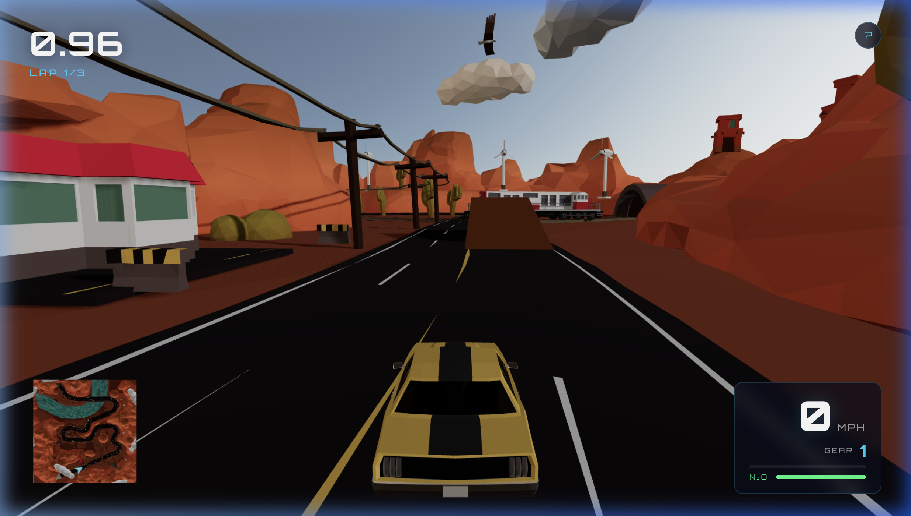

```
██████╗ ███████╗███████╗███████╗██████╗ ████████╗
██╔══██╗██╔════╝██╔════╝██╔════╝██╔══██╗╚══██╔══╝
██║  ██║█████╗  ███████╗█████╗  ██████╔╝   ██║   
██║  ██║██╔══╝  ╚════██║██╔══╝  ██╔══██╗   ██║   
██████╔╝███████╗███████║███████╗██║  ██║   ██║   
╚═════╝ ╚══════╝╚══════╝╚══════╝╚═╝  ╚═╝   ╚═╝   
                                                   
 ██████╗██╗██████╗  ██████╗██╗   ██╗██╗████████╗ 
██╔════╝██║██╔══██╗██╔════╝██║   ██║██║╚══██╔══╝ 
██║     ██║██████╔╝██║     ██║   ██║██║   ██║    
██║     ██║██╔══██╗██║     ██║   ██║██║   ██║    
╚██████╗██║██║  ██║╚██████╗╚██████╔╝██║   ██║    
 ╚═════╝╚═╝╚═╝  ╚═╝ ╚═════╝ ╚═════╝ ╚═╝   ╚═╝   
```
 
<div align="center">
### `floor it. drift it. own it.`
 

 
<br/>
[](https://www.typescriptlang.org/)
[](https://react.dev/)
[](https://threejs.org/)
[](https://rapier.rs/)
[](https://vitejs.dev/)
[](./LICENSE)
 
</div>
----
 
## ⚡ The Pitch
 
> **Desert Circuit** is a high-octane, browser-native 3D racing game. No Unity. No Unreal. No nonsense — just React, physics, and raw speed baked directly into your tab.
 
One player. Multiple AI opponents. An unforgiving desert loop. React Three Fiber and a custom Rapier suspension system doing the heavy lifting so you can focus on the only thing that matters: **crossing that finish line first.**
 
---
 
## 🏁 Demo
 
```
                     ┌─────────────────────────────┐
                     │                             │
              🏎️💨   │   http://localhost:5173     │
                     │                             │
                     └─────────────────────────────┘
                         npm install && npm run dev
```
 
> 💡 No account. No install wizard. No splash screen begging for your email.  
> Just open, race, and win.
 
---
 
## 🎮 Controls
 
```
  ┌───┐   ┌───┬───┬───┐
  │ W │   │ ↑ │   │   │     W / ↑  ──  Accelerate
  ├───┼───┼───┤   │   │     S / ↓  ──  Reverse
  │ A │ S │ D │   │   │     A / ←  ──  Steer Left
  └───┴───┴───┘   │   │     D / →  ──  Steer Right
                  └───┘
  
  ┌─────────────────────────┐   ┌────────┐
  │         SPACE           │   │  SHIFT │
  │      Drift / Brake      │   │  Boost │
  └─────────────────────────┘   └────────┘
 
  H  ──  Honk          C  ──  Cycle camera
  R  ──  Reset run      M  ──  Toggle minimap
  I  ──  Help overlay   U  ──  Toggle sound
  ESC ─  Pause
```
 
---
 
## ✨ Feature Set
 
| 🔧 System | 💬 What It Does |
|---|---|
| 🚗 **Player Car** | Rapier rigid bodies with custom suspension + traction loop |
| 🤖 **AI Opponents** | Race the full desert loop without hand-holding |
| 🏆 **Lap System** | Checkpoint-gated laps — cheaters don't prosper |
| ⏱️ **Race Flow** | Countdown start → finish → failure states, fully handled |
| 📸 **Camera Modes** | Cycle through views in real-time |
| 🗺️ **Minimap** | Always-on spatial awareness |
| 💥 **VFX** | Reactive particles for boost, brake, and zone transitions |
| 🔊 **Audio** | Positional sound for engine, train, water zones, and boost |
| ⏸️ **Pause** | ESC. Because you'll need it. |
| 🧾 **Telemetry** | Per-frame mutable state — zero React re-renders in the hot path |
 
---
 
## 🏗️ Architecture
 
```
src/
├── app/              ← Root shell, global styles, entrypoint
│
├── entities/         ← The world's actors
│   ├── vehicle/      ← Player car: Rapier body, suspension, traction
│   ├── ai/           ← Opponents who actually try
│   ├── track/        ← Desert loop geometry
│   ├── checkpoint/   ← Sensor triggers for lap validation
│   ├── train/        ← The train (yes, there's a train)
│   └── boundary/     ← The invisible walls of consequence
│
├── features/         ← Cross-cutting gameplay systems
│   ├── controls/     ← Keyboard input
│   ├── cameras/      ← View cycling
│   ├── particles/    ← VFX
│   └── audio/        ← Positional sound engine
│
├── game/
│   ├── scene/        ← RaceScene.tsx — physics world + render tree
│   ├── state/        ← store.ts — Zustand race state + actions
│   ├── config/       ← Tuning constants
│   └── ui/           ← HUD, minimap, overlays
│
└── shared/           ← Asset preloaders, runtime helpers
```
 
### 🧠 Design Decisions Worth Knowing
 
**Why mutable telemetry?**  
Per-frame vehicle data (speed, RPM, g-force) lives in a plain `mutation` object — not Zustand. Calling `setState` at 60 fps would blow up React's reconciler. This keeps the render loop lean and the React tree calm.
 
**Why checkpoint-gated laps?**  
Straight-line shortcuts are not valid racing lines. The sensor enforces the full loop every time.
 
**Why Zustand over Context?**  
Race state has dozens of consumers spread across deep component trees. Context would cascade re-renders. Zustand slices are surgical.
 
---
 
## 🛠️ Tech Stack
 
```
                    ┌─────────────────────────────────┐
                    │         DESERT CIRCUIT          │
                    │         Runtime Stack           │
                    └──────────────┬──────────────────┘
                                   │
          ┌────────────────────────┼────────────────────────┐
          │                        │                        │
     ┌────▼────┐             ┌─────▼─────┐           ┌─────▼─────┐
     │  React  │             │  Three.js │           │  Rapier   │
     │   18    │             │  + R3F    │           │ Physics   │
     └────┬────┘             └─────┬─────┘           └─────┬─────┘
          │                        │                        │
          └────────────────────────┼────────────────────────┘
                                   │
                              ┌────▼────┐
                              │ Zustand │
                              │  Store  │
                              └────┬────┘
                                   │
                    ┌──────────────┼──────────────┐
                    │              │              │
               ┌────▼───┐   ┌─────▼────┐   ┌────▼────┐
               │  Vite 5 │   │   Drei   │   │ Vitest  │
               └─────────┘   └──────────┘   └─────────┘
```
 
---
 
## 🚀 Quick Start
 
```bash
# Clone the repo
git clone https://github.com/your-username/desert-circuit.git
cd desert-circuit
 
# Install dependencies (Node 20+, npm 10+ required)
npm install
 
# Start the dev server
npm run dev
```
 
Open `http://localhost:5173` and floor it.
 
---
 
## 📜 Scripts
 
```bash
npm run dev          # 🔥  Fire up the dev server
npm run build        # 📦  Production build with chunk splitting
npm run preview      # 👁️   Serve the production build locally
npm run typecheck    # 🔍  TypeScript strict mode check
npm run lint         # 🧹  ESLint flat config
npm run test         # 🧪  Vitest in watch mode
npm run test:run     # ✅  One-shot test run
npm run check        # 🔒  lint + test + build (CI gate)
```
 
---
 
## 📦 Required Assets
 
The scene won't load without these. Make sure they're present:
 
```
public/
├── models/
│   ├── track-draco.glb       ← The desert circuit
│   ├── chassis-draco.glb     ← Car body
│   └── wheel-draco.glb       ← Wheels (4 of them, ideally)
├── textures/
│   └── dikhololo_night_1k.hdr ← Environment lighting
└── sounds/
    └── *.mp3 / *.ogg          ← Engine, boost, ambient, train
```
 
> **Missing assets?** The scene may load partially or silently refuse to cooperate. Check `public/models` and `public/textures` first.
 
---
 
## 🐛 Troubleshooting
 
**🚗 Car or track is missing**  
Assets in `public/models` or `public/textures` are absent or corrupted. Restore them and restart the dev server from the repo root.
 
**🔇 No audio**  
Browsers block autoplay. Start a race from the intro screen — that user gesture unlocks audio context. Toggle with `U`.
 
**🏁 Laps not counting**  
You skipped the checkpoint. Go back, hit it, and try again. The circuit remembers.
 
---
 
## 🏎️ Production Build
 
```bash
npm run build    # Chunks the heavy R3F/Three.js vendor stack separately
npm run preview  # Serve and verify before shipping
```
 
Chunk splitting keeps the bundle from turning into a 4MB monolith. Your CDN will thank you.
 
---
 
## 🗺️ Code Entrypoints
 
| File | Role |
|---|---|
| `src/app` | App shell, global styles, React root |
| `src/game/scene/RaceScene.tsx` | Physics world, render tree, race triggers |
| `src/game/state/store.ts` | Zustand store — all race state and actions live here |
| `src/entities` | Vehicle, AI, track, checkpoint, train, boundary |
| `src/features` | Controls, cameras, particles, audio |
 
---
 
## 📐 Quality Gates
 
This repo is wired for maintainability:
 
- ✅ `strict` TypeScript — no `any` escapes
- ✅ Alias-based imports — no `../../../` pyramid of doom
- ✅ ESLint flat config — modern, zero-legacy linting
- ✅ Vitest coverage — race store flow is tested
- ✅ Committed lockfile — reproducible installs
- ✅ Chunk-split production build — sane bundle sizes
- ✅ Prettier config — formatting arguments are over
---
 
<div align="center">
**Built for the browser. Tuned for feel. Ready to race.**
 
`W` to go. `Space` to slide. `Shift` to fly.
 
---
 
*Desert Circuit — where the physics are tight and the desert is endless.*
 
</div>
